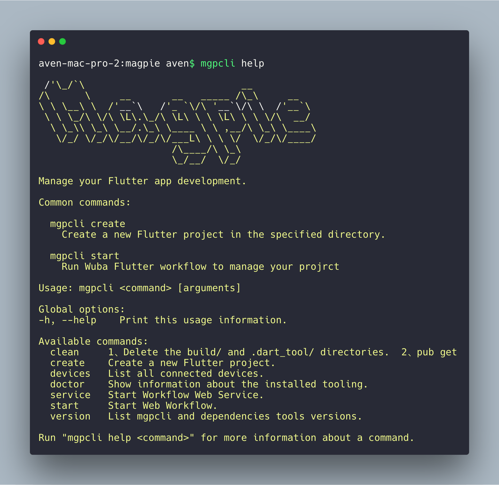

# Magpie 脚手架

通过命令行，快速创建Flutter工程和搭建调试环境。
请提前安装好Flutter环境，具体流程参考Flutter官方指引:

> [https://flutter.dev/docs/get-started/install](https://flutter.dev/docs/get-started/install)

## 环境变量配置
为了进行Dart CLI的开发，还需要将Dart环境进行配置，参考如下：
### macOS
```
export PATH="/*flutter directory*/flutter/bin/cache/dart-sdk/bin:$PATH"
export PATH="$PATH":"$HOME/.pub-cache/bin"
```
### Windows
flutter环境变量配置，在用户变量中选择`PATH`，双击后在末尾增加如下配置
```
\*flutter directory*\flutter\bin;
```
```
\*flutter directory*\flutter\bin\cache\dart-sdk\bin;
C:\Users\{替换用户名}\AppData\Roaming\Pub\Cache\bin
```

通过如上环境配置后，再运行pub命令安装magpie_cli脚手架。
> 1.如何让环境变量生效 --- 可以关闭原有终端窗口再重新打开新终端
> 2.如果使用flutter pub安装，需要替换上面Pub-Cache的路径为flutter安装路径

环境配置正常后，就可以通过pub下载&安装我们的脚手架
```
pub global activate magpie_cli
```

## Magpie CLI源码开发
如果需要开发调试源代码，可以继续往下看。

脚手架支持2种模式运行，1、Release模式 2、Debug 模式
### Release模式

Release 模式为Magpie开发小组对外发布的稳定版本，不支持断点等调试手段。感兴趣的同学可以在用户根目录下的 .pub-cache/hosted/ 下的pub.flutter-io.cn 或者 pub.dartlang.org 文件夹下找到对应版本的源码进行Review和调试。

```
pub global activate magpie_cli
```

### Debug 模式

Debug 模式为Magpie开发小组日常开发环境，感兴趣的同学也可以参与Magpie团队一起开发，大家一起创造更好的Flutter的开发环境。

#### 下载 Debug 源代码 & 本地发布
```
git clone https://github.com/wuba/magpie.git
pub global activate --source path **/magpie 
```
注意 `**为magpie`全路径。

本地发布后即可在命令行运行命令集，此后就可以修改magpie源码进行调试

#### 源码Debug环境配置
1、进入workflow 和 template/module目录下分别运行 flutter pub get  
2、用vscode打开工程，定位到我们clone下来的源码路径"**/magpie/bin/mgpcli.dart，右键菜单中选择运行。至此Magpie工程就可以断点Debug了

#### 基于Pub安装后的Release版本切换到源码调试
1、进入用户根目录下的.pub-cache/bin/mgpcli  
2、vi 打开mgpcli脚本文件我们可以看到dart "**/**/.pub-cache/global_packages/magpie_cli/bin/mgpcli.dart.snapshot.dart2" "$@"  
3、把文件中dart后面的路径指向我们clone下来的源码路径"**/magpie/bin/mgpcli.dart"  

### 命令集 
注意: 除create命令外其他命令都必须**在新建工程目录下**运行

| 指令    | 作用           |
| ------- | -------------- |
| create  | 新建工程       |
| start   | 启动workflow   |
| clean   | 清理缓存和依赖 |
| doctor  | 环境检查       |
| version | 版本信息       |
| help    | 帮助           |



