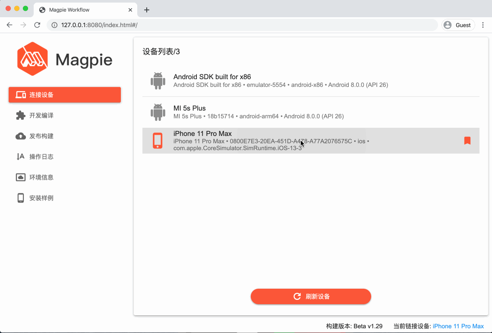
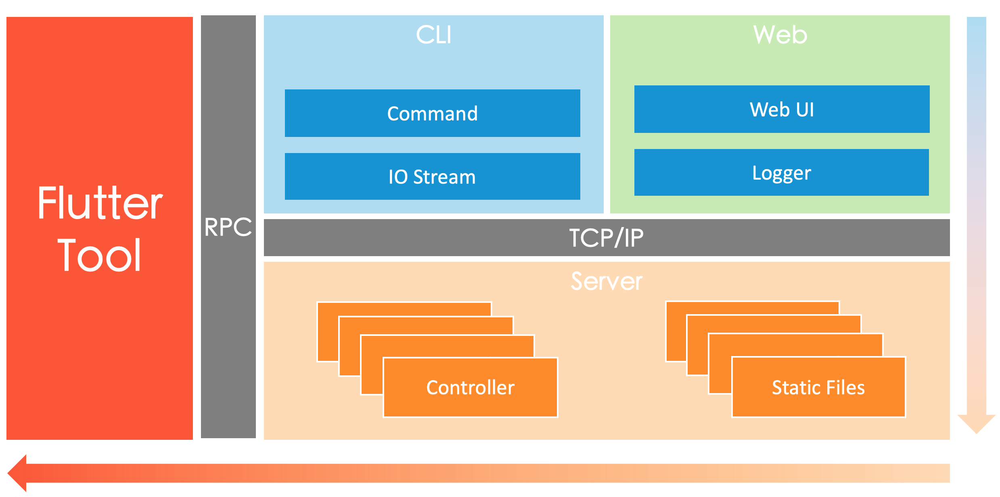

[English](README.md) [中文说明](README-zh.md)

[](https://pub.dartlang.org/packages/magpie_cli)
[](https://github.com/wuba/magpie)
[](LICENSE)

Magpie Workflow is a visualized platform which is designed to create, develop and compile your 
standalone flutter module;

It's designed to manage the complexity of building mixed flutter apps,  connect developers and flutter like the Magpie Bridge. This project has three parts:
* cli: similar to flutter tool, used to create template project and start the web server;
* workflow web： A flutter-web application used to develop & compile the flutter module;
* workflow server：A dart server work with flutter-web;





## How to use

### Install cli

Make sure you have already installed the flutter sdk, the version should be **v1.12.x**
If you haven't configure the flutter and dart environment， follow the guide at [Magpie CLI#environment](CLI.md)。

```shell
pub global activate magpie_cli
```

For details about cli development, go to [cli](CLI.md).

### Start Workflow

Since you've installed the `mgpcli`, you may start to create a flutter  module project now:
**1.Create module project**

```shell
mgpcli create -n flutter_sample
```

**2.Start service**

```shell
cd flutter_sample
mgpcli start
```

**3.Switch to browser**

The browser should  have been opened instantly，[http://127.0.0.1:8080](http://127.0.0.1:8080)

## Contribution
As we mentioned previously, `Magpie` has multi-parts;

* cli: go to [cli](CLI.md)
* workflow web/server: go to [workflow](workflow/README.md)

Magpie also has some relative projects, you may check out these codebase as listed bellow:

> Magpie Native&Dart SDK

Work with Magpie Workflow, it's native sdk which should be integrated into App. [https://github.com/wuba/magpie_sdk](https://github.com/wuba/magpie_sdk)

> Magpie Fly 

A Flutter UIKit.[https://github.com/wuba/magpie_fly](https://github.com/wuba/magpie_fly)

> Magpie Log

A visualized dynamic programme for log collection based on flutter. [https://github.com/wuba/magpie_log](https://github.com/wuba/magpie_log)

## About

This project is maintained by **58 Magpie Tech Team**, thank you all for the contributions :)

[avenwu](https://github.com/avenwu), [CoCodeDZ](https://github.com/3aaap), [haijun](https://github.com/153493932), [hxinGood](https://github.com/hxinGood), [iamagirlforios](https://github.com/iamagirlforios), [Kcwind](https://github.com/Kcwind), [lyx0224](https://github.com/lyx0224), [MuYuLi](https://github.com/MuYuLi), [xiubojin](https://github.com/xiubojin), [zdl51go](https://github.com/zdl51go), [zhangkaixiao23](https://github.com/zhangkaixiao23)

Thanks to Alina_0516 for the design.

## LICENSE

This project is open source under the [BSD license](LICENSE).

We are using the `flutter tools` codebase and made some changes; There are many libraries we depend on, here is a short list, thanks you all:

[effective_dart](https://pub.dev/packages/effective_dart), [provider](https://pub.dev/packages/provider), [qr_flutter](https://pub.dev/packages/qr_flutter), [process_run](https://pub.dev/packages/process_run), [dio](https://pub.dev/packages/dio), [jaguar](https://pub.dev/packages/jaguar)

For more details please refer to pubspec.yaml

