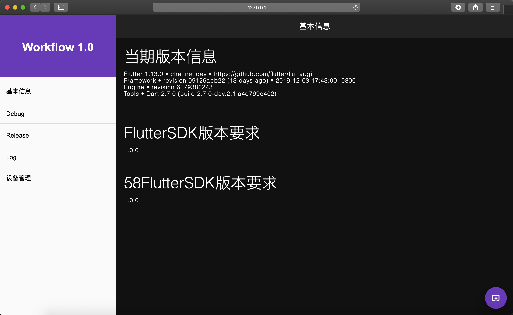

# 主界面排版

| 时间         | 说明        | 修改人  |
| ---------- | --------- | --------  |
| 2019.12.12 | 基本信息界面初稿 | 金修博 |
| 2019.12.17 | 使用Server数据填充UI | 金修博 |

## 模块设计
添加基本信息页面，分模块显示标题和具体内容。

```
├── component
│   └── info
│       └── baseinfo_page.dart
└── main.dart
```

## 预览
