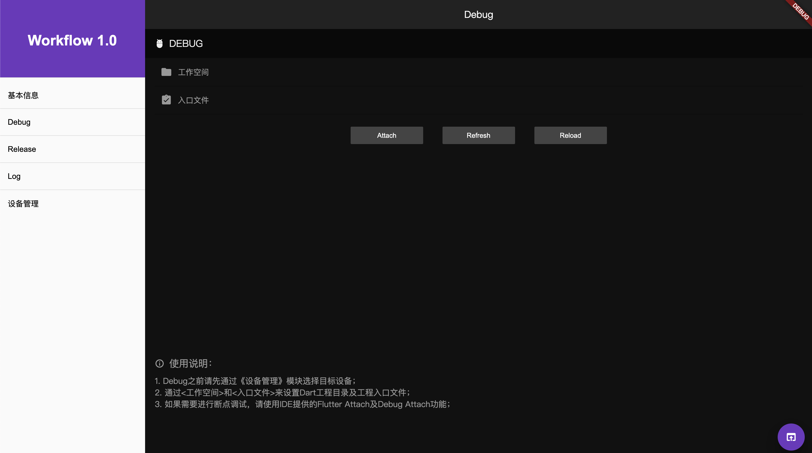

# 模块标题

| 时间         | 说明        | 修改人  |
| ---------- | --------- | --------  |
|  2019.12.15     | Debug界面       | songdezhong     |
|            |           |           |

## 模块设计
带入或输入工作目录及入口文件，点击Attach按钮进行调试关联，其他两个按钮实现热更新及热重载。
```
├── component
│   ├── debug_module.dart
└── main.dart

```

## 预览

