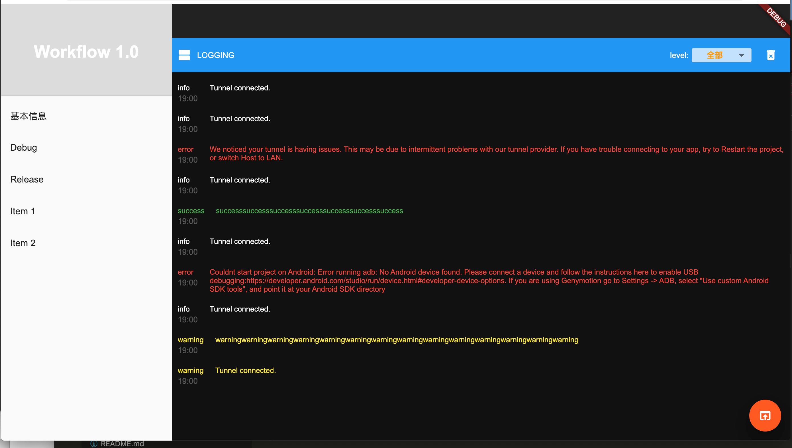
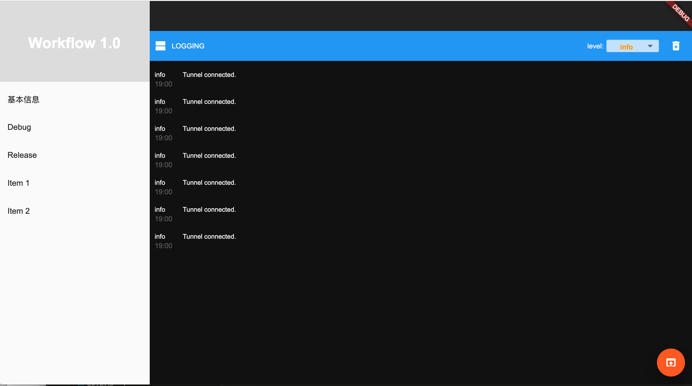
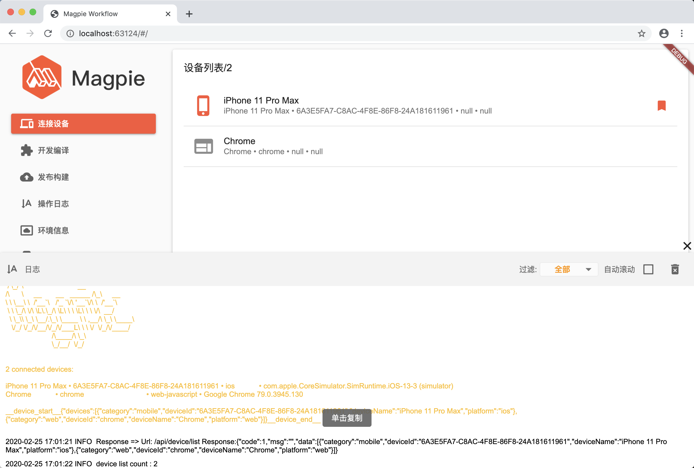

# 主界面排版

| 时间         | 说明        | 修改人  |
| ---------- | --------- | --------  |
|  2019.12.12     | 日志界面       | 吴丹     |
|  2020.2.25     |  新增日志层       | 吴丹     |

## 模块设计
添加日志界面布局，可筛选log类型：
* 点击头部右侧筛选，可筛选出对应类型的log数据
* 点击头部清空icon，可清空日志区域的所有日志

* 新增日志层，在除了原日志界面的其他界面，都能调起日志层界面，日志层被放到了顶层，保证界面在loading状态的时候页能对弹出的日志进行操作

```
├── component
│   └── log
│       └── filter_appbar.dart
│       └── log_item_widget.dart
│       └── log_listview.dart
│       └── log_page.dart
│       └── log_utils.dart
│       └── log_overlay.dart

```
## 预览




