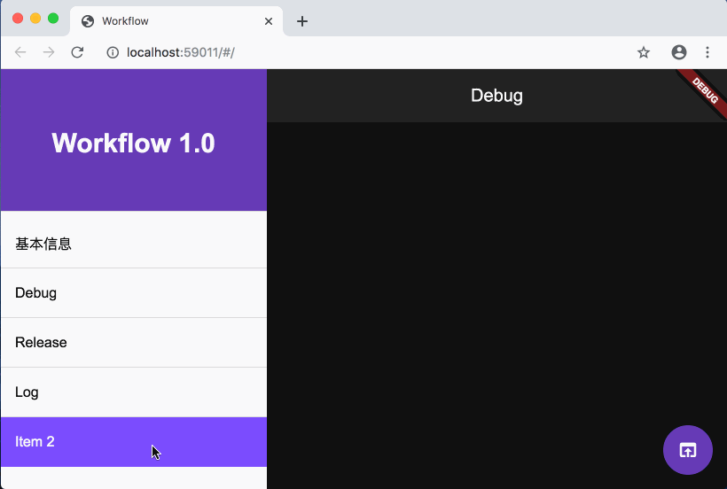

# 主界面排版

| 时间         | 说明        | 修改人  |
| ---------- | --------- | --------  |
|  2019.12.11     | 主界面初稿       | 吴朝彬     |
|  2019.12.13     | 菜单支持hover效果       | 吴朝彬     |

## 模块设计
添加主界面骨架，基本样式为左右布局：
* 左侧菜单栏，类似Drawer，固定展开
* 有侧内容区，可固定为日志面板，也可按需替换
* 添加菜单的hover支持

```
├── component
│   ├── hover_tile.dart
│   └── sidebar.dart
└── main.dart

```
## 预览


