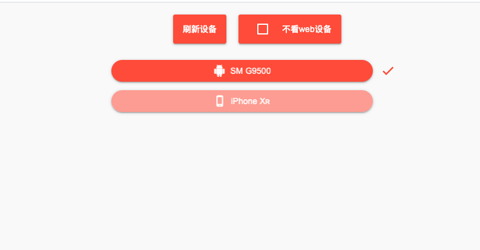

# 模块标题

| 时间         | 说明        | 修改人  |
| ---------- | --------- | --------  |
|  2019.12.16     | 设备管理       | 李义新     |
|    2019.12.17   | 展示真实device |  李义新    |

## 模块设计
设备管理功能分为2部分
* server调用cli命令行，client输出当前连接的设备(当前调用系统`flutter devices`)
* 维护当前选中的设备变量，供其他模块调用

#### 1.代码tree
```
lib
├── component
│   ├── device_manager.dart
└── main.dart
```
```
── server
│   ├── lib
│   │   ├── controller
│   │   │   ├── device_controller.dart
```
```
   ├── model
│   │   ├── simple_device.dart
│   │   └── simple_device.g.dart
```

#### 2. flutter device输出格式
和CLI约定的flutter devices输出格式，
由于Command的结果输出到了控制台，格式不固定，故加上`__device_start__` 、`__device_end__`前后缀方便解析json
```
__device_start__{"devices":[{"category":"mobile","deviceId":"98895a37564c595950","deviceName":"SM
G9500","platform":"android"},{"category":"mobile","deviceId":"1F24E9FD-87DB-4FAF-99D8-D2DCC802E6D6",
"deviceName":"iPhone
Xʀ","platform":"ios"},{"category":"web","deviceId":"chrome","deviceName":"Chrome","platform":"web"},
{"category":"web","deviceId":"web-server","deviceName":"Web
Server","platform":"web"}]}__device_end__
```
#### 3. 获取当前的设备id
` SpUtil.getString("current_device").then(value){
}`

## 预览



