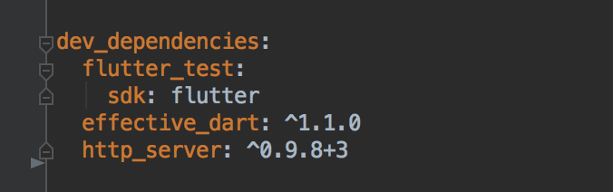

# Server模块

| 时间         | 说明        | 修改人  |
| ---------- | --------- | --------  |
|  2019.12.10     | server模块初始化       | 吴朝彬     |

## 模块设计
Server模块为独立的dart工程，为了在同一个IDE内同时开发Web和Server，可能需要做一些hack处理。

Server的依赖库配置在`server/pubspec.yaml`中, 启动server端可以通过命令
> ./start-server

如果IDE无法识别Server使用的依赖库，可以临时修改外层web的依赖库，将server的依赖添加到外层pubspec.yaml的dev_dependencies节点下面。**注意不需要提交**



API的添加请参考[request_route.dart](../server/lib/request_route.dart)。
配置routes函数：
* key为请求的接口
* value为处理请求的函数

## API示例
请求接口`/api/list`，得到一串神秘代码
```
user:workflow aven$ curl localhost:8080/api/list
🏊⚽️🏀🏈⚾️🎾🏐🏉🎱⛳️🏌🏓🏸🏒🏑🏏🎿
```
*PS: 注意所有API约定以`/api`开头，才能命中函数解析器*

