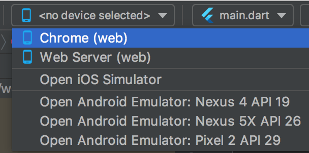
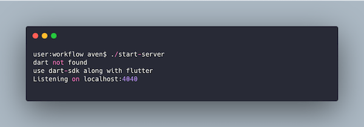
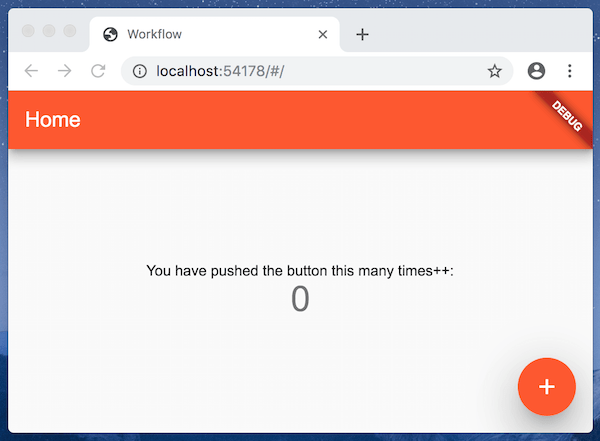

# 工程结构初始化

| 时间         | 说明        | 修改人  |
| ---------- | --------- | --------  |
|  2019.12.09     | 添加初始工程       | 吴朝彬     |

## 模块设计

顶级工程为flutter web项目，lib内包含web的源码。

启动web可以走命令，也可以走IDE的`Run`按钮。



server下为后端代码，目前包含一个测试server。启动后端通过以下命令：
> ./start-server


初始目录结构如下：
```
├── README.md
├── doc
│   └── module_web_server.md
├── lib
│   └── main.dart
├── pubspec.yaml
├── scripts
│   ├── newdoc
│   └── start-server
├── server
│   └── www.dart
├── start-server -> scripts/start-server
├── web
│   └── index.html
```
## 预览

| Server | Web |
| ----- | ----- |
|  |  |
